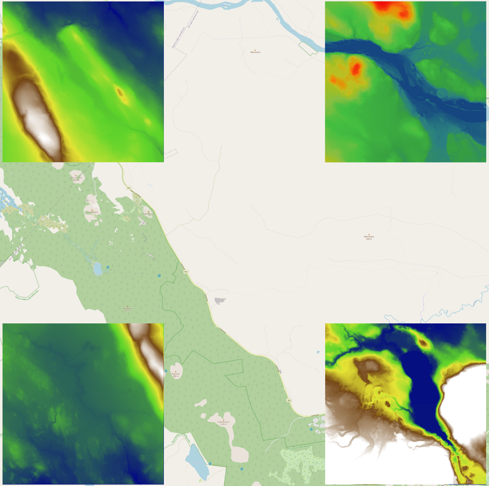

# Dynamic raster color with OpenLayers

A simple web application demo built with OpenLayers. Showcases different approaches for adaptive colorization of data with OpenLayers.

The [demo application](https://jarvena.github.io/ol-demview) shows four examples, which of three are adaptive.  
All the alternatives load data from COG, and map the elevation values to color range.

- The top-left is adaptive, updating the colour range once map movements finish. Utilizes webgl for colour mapping
- The top-right is adaptive, updating the colour range once map movements finish. Utilizes webgl to encode elevation to rgb format, and OpenLayers raster source for colour mapping
- The bottom-left is adaptive, updating the colour range continuously. Utilizes webgl
- The bottom-right is static.

The application has simple buttons in top-right corner for enabling hillshade, and visualizing the intermediate rgb-dem instead of the adaptive colorization result. 

## Built with OpenLayers + Vite

This example demonstrates how the `ol` package can be used with [Vite](https://vitejs.dev/).

To get started, run the following (requires Node 14+):

    npx create-ol-app my-app --template vite

Then change into your new `my-app` directory and start a development server (available at http://localhost:5173):

    cd my-app
    npm start

To generate a build ready for production:

    npm run build

Then deploy the contents of the `dist` directory to your server.  You can also run `npm run serve` to serve the results of the `dist` directory for preview.

## Preparing raster TM35FIN JHS180 raster tiles using `gdal2tiles`

Add the `tms_JHS180TM35FIN.json` tile matrix set definition to gdal data directory. The example tiles were produced applying command:

    gdal2tiles --profile=JHS180-ETRS-TM35FIN -z 8-12 -w none -r near ./dem.tif ./out

`--profile` points to the tile matrix set definition, `-z` specifies resolution levels, `-w` skips map viewer outputs, and `-r` defines the interpolation method (nearest neighbor to avoid artifacts)